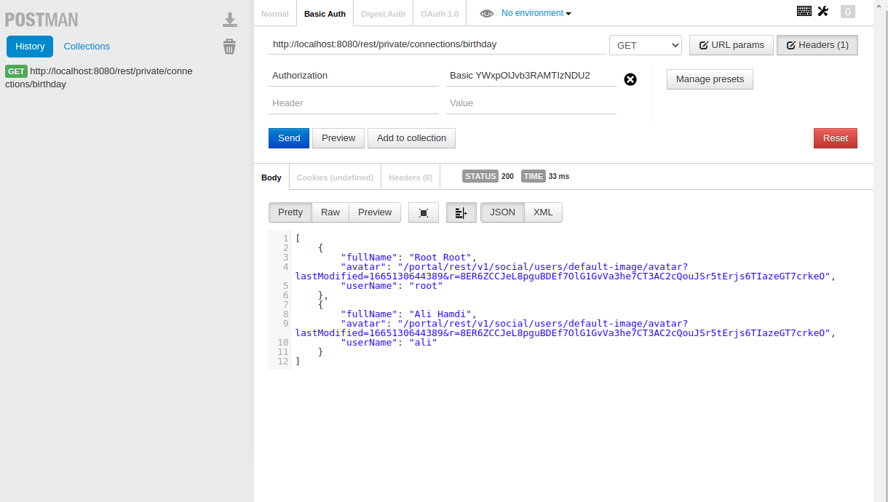
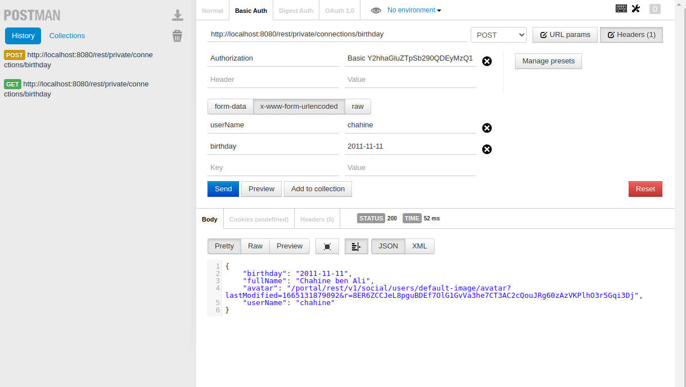
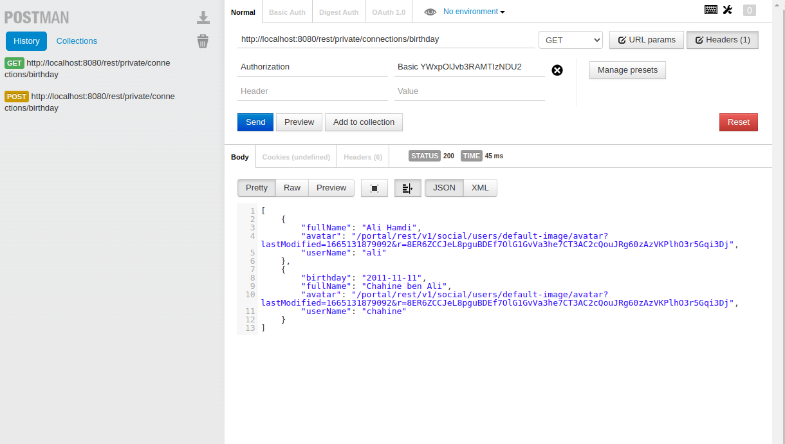

# Create a new REST service

 This page will describe how to create a new REST Service exposing data and how to deploy it in eXo 
Jax-RS ([JSR 311](https://jcp.org/aboutJava/communityprocess/final/jsr311/index.html)) is a Java API for developing applications using the REST architecture.

## Develop a Rest service
You will implement a new REST service that will return the list of users who are connected to the current user, with their birthday dates.
You will use the same extension we created in [Prepare your extension project tutorial](../prepare-extension-project)
1.  Copy the extension to the sources folder **$EXO_HOME/sources** and rename it to **my-connections-birthdays-extension** as described in [Rename your extension](../prepare-extension-project.md#rename-the-extension) tutorial
    ::: tip
    **$EXO_HOME** is the environment variable that contain the path to the working directory as requested in [Start eXo community](/guide/getting-started/start-community#start-exo-platform) page   
    :::  
3.  Create a new Java package *com.acme.services* under **my-connections-birthdays-extension/services/src/main/java**
4.  Create a new Java class **MyConnectionsBirthdaysService** under **my-connections-birthdays-extension/services/src/main/java/org/exoplatform/samples/birthday** . This class will represent the RESTfull service. A RESFTful web service in eXO platform : 
    1.  Should implement the class interface *org.exoplatform.services.rest.resource.ResourceContainer*
    2.  Is compliant with JAX-RS specification which means it uses all available annotation to define the access URL path, the HTTP verbs (@Get , @POST, @DELETE, etc...)
    3.  Following is the source code for our RESTful service that will load the list of people connected with the current user with some of their profile properties 
    ```java
        package org.exoplatform.samples.birthday;

        import org.exoplatform.commons.utils.ListAccess;
        import org.exoplatform.services.log.ExoLogger;
        import org.exoplatform.services.log.Log;
        import org.exoplatform.services.rest.resource.ResourceContainer;
        import org.exoplatform.social.core.identity.model.Identity;
        import org.exoplatform.social.core.manager.IdentityManager;
        import org.exoplatform.social.core.manager.RelationshipManager;
        import org.json.JSONArray;
        import org.json.JSONObject;

        import javax.annotation.security.RolesAllowed;
        import javax.ws.rs.*;
        import javax.ws.rs.core.Context;
        import javax.ws.rs.core.Response;
        import javax.ws.rs.core.SecurityContext;
        import java.time.format.DateTimeFormatter;
        import java.util.Locale;

        @Path("connections/birthday") //Access path to our REST service
        public class MyConnectionsBirthdayRESTService implements ResourceContainer {
            // Logger for our class
            private static final Log LOG = ExoLogger.getLogger(MyConnectionsBirthdayRESTService.class);

            // Service used to load user identities
            private IdentityManager identityManager;

            //  Service used to manage relationships with other users
            private RelationshipManager relationshipManager;

            private static String BIRTHDAY_PROPERTY = "birthday";

            public MyConnectionsBirthdayRESTService(IdentityManager identityManager, RelationshipManager relationshipManager) {
                this.identityManager = identityManager;
                this.relationshipManager = relationshipManager;
            }

            @GET
            @RolesAllowed("users")
            public Response getMyConnectionsBirthday(@Context SecurityContext securityContext) {
                
                // Load current authenticated user
                String authenticatedUserName = securityContext.getUserPrincipal().getName();
                try {
                // Load the identity of the current user
                Identity authenticatedUser = identityManager.getOrCreateUserIdentity(authenticatedUserName);
                // Load list of people connected with him
                ListAccess<Identity> connections = relationshipManager.getConnections(authenticatedUser);
                Identity[] connectionsIdentities = connections.load(0, connections.getSize());
                
                // Create a JSON array that will be returned with the response
                JSONArray jsonArray = new JSONArray();
                for (Identity connection : connectionsIdentities) {
                    JSONObject connectionJSON = new JSONObject();
                    connectionJSON.put("userName", connection.getRemoteId());
                    connectionJSON.put("fullName", connection.getProfile().getFullName());
                    connectionJSON.put("avatar", connection.getProfile().getAvatarUrl());
                    connectionJSON.put(BIRTHDAY_PROPERTY, connection.getProfile().getProperty(BIRTHDAY_PROPERTY));
                    jsonArray.put(connectionJSON);
                }
                
                // If everything is OK, we return a HTTP 200 response with the Json array
                return Response.ok(jsonArray.toString()).build();
                } catch (Exception e) {
                // Something went wrong, an error is logged and a HTTP 500 error is returned
                LOG.error("Error getting user connections for {}", authenticatedUserName, e);
                return Response.serverError().build();
                }
            }
        }
    ```
5.  Add the configuration of the RESTFul web service to let the server deploy it 
    ```xml
        <?xml version="1.0" encoding="UTF-8"?>
        <configuration xmlns:xsi="http://www.w3.org/2001/XMLSchema-instance"
        xsi:schemaLocation="http://www.exoplatform.org/xml/ns/kernel_1_2.xsd http://www.exoplatform.org/xml/ns/kernel_1_2.xsd"
        xmlns="http://www.exoplatform.org/xml/ns/kernel_1_2.xsd">
            <!-- register new event listener that will be fired when a user updates his profile-->
            <component>
                <key>org.exoplatform.samples.birthday.MyConnectionsBirthdayRESTService</key>
                <type>org.exoplatform.samples.birthday.MyConnectionsBirthdayRESTService</type>
            </component>
        </configuration>
    ```
6.  Build & deploy the extension in your eXo platform server :
    ```shell
    > cd $EXO_HOME/sources/my-connections-birthdays-extension
    > mvn clean install
    > cp services/target/my-connections-birthday-services.jar $EXO_HOME/lib 
    > cp webapp/target/my-connections-birthday-webapp.war $EXO_HOME/webapps
    ```
7.  Add the built files **** and **** to the volumes section of the eXo platform container :
    ```
        volumes:
         - exo_data:/srv/exo
         - exo_logs:/var/log/exo
         - $EXO_HOME/webapps/my-connections-birthday-webapp.war:/opt/exo/webapps/my-connections-birthday-webapp.war
         - $EXO_HOME/lib/my-connections-birthday-services.jar:/opt/exo/lib/my-connections-birthday-services.jar
    ```
8.  Start eXo platform containers using docker-compose :
    ```shell
    > docker-compose -f $EXO_HOME/docker-compose.yml up
    ```

9.  When the server is started, go to http://localhost, login with an administrator account (*root* for example) and create some users. Then login with those users to get them connected with each others.
10. Using a HTTP client (for example [Postman](https://www.postman.com/)) :
    1.  In the URL put : http://localhost/rest/private/connections/birthday
    2.  Use Basic authentication mode, then put the username/password of one of your users
    3.  You should get a JSON response like in the following image :
                
11. As you noticed, there is no birthday date for those connections, thus you will need to provide how they can add it to their profiles.
12. You will add a new function to the **MyConnectionsBirthdayRESTService.java** RESTful service that will update users profile with a birthday date. Add the following function to the Restful service :
   ```java
        // We added POST verb since this function will update data on the server
        @POST
        @RolesAllowed("users")
        public Response updateBirthday(@Context SecurityContext securityContext, @FormParam("birthday") String birthday,@FormParam("userName") String userName) {
            String authenticatedUserName = securityContext.getUserPrincipal().getName();
            if(!authenticatedUserName.equalsIgnoreCase(userName)) {
            // Only the user himself is able to update his birthday date
            LOG.error("{} could not update the birthday of {}", authenticatedUserName, userName);
            return Response.status(Response.Status.FORBIDDEN).build();
            }
            try {
            // Do a parsing to the received date and throw an exception if it is not valid
            LocalDate.parse(birthday, PARSER);
            // get the user identity and upda te the profile
            Identity authenticatedUser = identityManager.getOrCreateUserIdentity(authenticatedUserName);
            Profile authenticatedUserProfile = authenticatedUser.getProfile();
            // set the received birthday in the user profile
            authenticatedUserProfile.setProperty(BIRTHDAY_PROPERTY, birthday);
            identityManager.updateProfile(authenticatedUserProfile);
            // Prepare a response with the updated profile of the user
            JSONObject jsonObject = new JSONObject();
            jsonObject.put("userName", authenticatedUser.getRemoteId());
            jsonObject.put("fullName", authenticatedUserProfile.getFullName());
            jsonObject.put("avatar", authenticatedUserProfile.getAvatarUrl());
            jsonObject.put(BIRTHDAY_PROPERTY, authenticatedUserProfile.getProperty(BIRTHDAY_PROPERTY));
            return Response.ok(jsonObject.toString()).build();
            } catch (DateTimeParseException ex) {
            LOG.error("Could not parse date {}", birthday, ex);
            return Response.serverError().build();
            } catch (Exception e) {
            LOG.error("Could not update profile of user {}", authenticatedUserName, e);
            return Response.serverError().build();
            }
        } 
   ```         
13. Rebuild then redeploy the new jar & war in the eXo platform server : 
```shell
    > cd $EXO_HOME/sources/my-connections-birthdays-extension
    > mvn clean install
    > cp services/target/my-connections-birthday-services.jar $EXO_HOME/lib 
    > cp webapp/target/my-connections-birthday-webapp.war $EXO_HOME/webapps
```
1.  Start eXo platform containers using docker-compose :
    ```shell
       > docker-compose -f $EXO_HOME/docker-compose.yml up
    ```
1.  Using a HTTP client (for example [Postman](https://www.postman.com/)) :
    1.  In the URL put : http://localhost/rest/private/connections/birthday
    2.  Use the verb *POST* instead of *GET*
    3.  Use Basic authentication mode, then put the username/password of one of your users
    4.  Fill the form parameters indicating the userName and the birthday of the logged-in user
    5.  You should get a JSON response like in the following image :
          
    6.  When calling again the endpoint to get the list of connections, we can see that the birthday of the user was updated
           